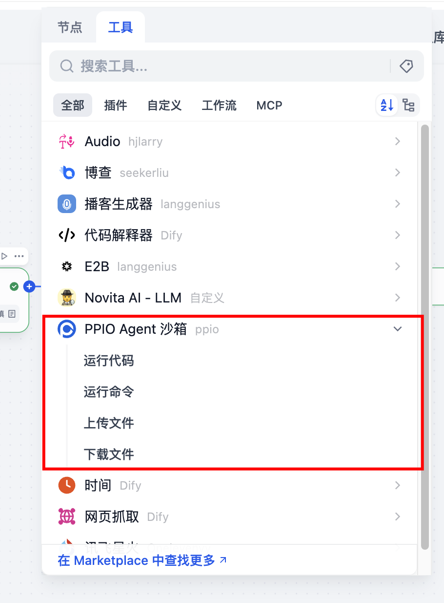
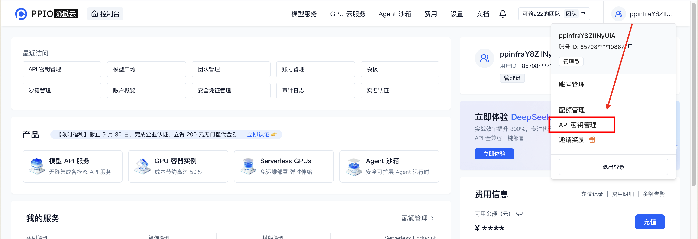
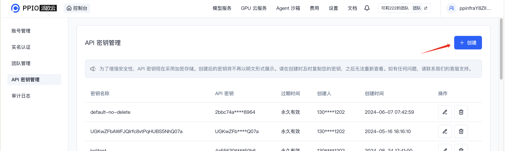
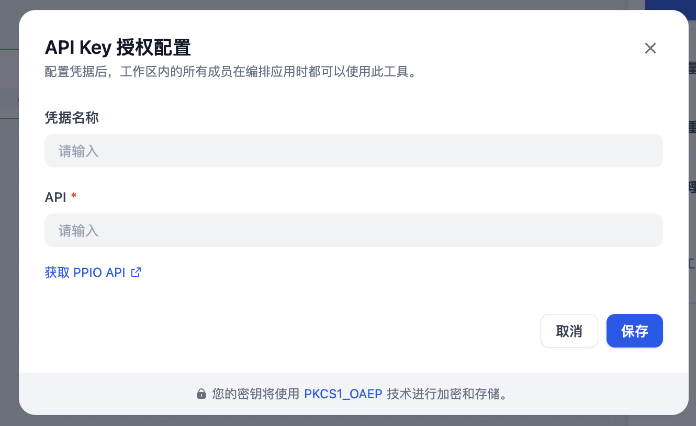

## PPIO Sandbox

### Introduction

This is a plugin for Dify to integrate with [PPIO Agent Sandbox](https://ppio.com/ai-computing/sandbox?utm_source=github_dify&utm_medium=github_readme&utm_campaign=link). It allows you to run tasks in a remote isolated sandbox environment.

### Features

- Run code in a PPIO sandbox. Currently supports Python and JavaScript code.
- Run a Linux command in a PPIO sandbox.
- Upload file to PPIO sandbox. Requires an existing sandbox.
- Download file from a PPIO sandbox. Requires an existing sandbox.

### Usage

1. Install the plugin from Dify's marketplace.

2. After installing the plugin, Add it to your workflow.

3. [Create a PPIO account.](https://ppio.com/user/register?invited_by=JXATT3&utm_source=github_dify&utm_medium=github_readme&utm_campaign=link)
4. Create and save your API key [here](https://ppio.com/settings/key-management?utm_source=github_dify&utm_medium=github_readme&utm_campaign=link).
   - Click your [User Avatar] → [API Key Management] to access the console.
     
   - Select **[+ Create]** to generate a new API Key. Customize a name, and note that the key **will only be displayed once upon generation** — ensure to copy and save it securely for uninterrupted future use.
     

5. In the PPIO sandbox tool in your Dify workflow, click on "To Authorize" button, paste your API key, and click on "Save" button.
   
   

6. Now you can use the PPIO sandbox tool in your workflow or other apps.

Source code of this plugin: [https://github.com/cnJasonZ/dify-plugin-ppio-sandbox](https://github.com/cnJasonZ/dify-plugin-ppio-sandbox)